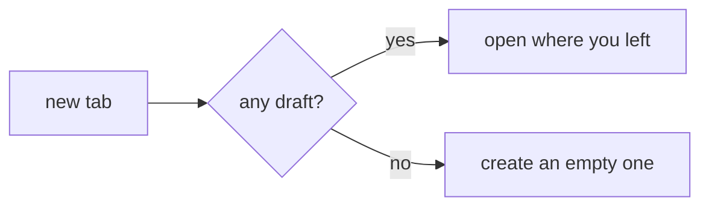
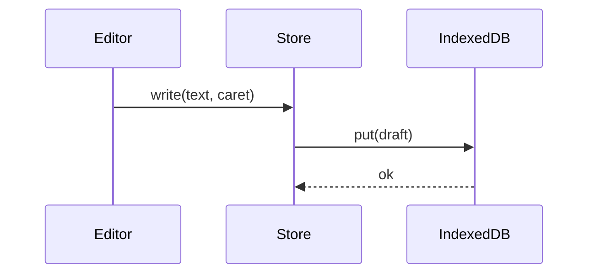

# Formatting test

## Headings

### Third level
#### Fourth level
##### Fifth level
###### Sixth level

Underlined heading
==================

Another underline
-----------------

## Emphasis

**bold**, *italic*, _also italic_, ***bold and italic***,
~~strikethrough~~, `inline code`, \*escaped\* and &amp; entity.

## Line break

This line ends without two spaces
and the next one still drops down.

## Lists

- item
- another item
  - nested
    - deeper
- third

1. first
2. second
   1. two point one
3. third

- [x] done task
- [ ] pending task
- [ ] task with **bold** and `code`

## Blockquote

> A quote.
>
> > A quote inside the quote.
>
> - with a list inside
> - and another item

## Horizontal rule

---

## Links

[inline link](https://example.com), [with a title](https://example.com "the title"),
[by reference][ref], <https://autolink.example.com> and https://bare-example.com
(bare autolink, without the angle brackets).

[ref]: https://example.com/reference 'the reference title'


## Code

```js
const sum = (a, b) => a + b;
console.log(`result: ${sum(2, 3)}`);
```

```python
def greeting(name: str) -> str:
    return f"hello, {name}"
```

```sql
SELECT id, name FROM users WHERE active = true ORDER BY name;
```

```klingon
this language does not exist and must not break the preview
```

```
fence without a language
```

    code by indentation

~~~
fence with tildes
~~~

## Table

| left     | center | right |
| :------- | :----: | ----: |
| a        |   b    |     1 |
| `code`   | **bo** |    42 |

## Footnote

A claim that needs a source.[^1]

[^1]: The source, down here.

## Maths

Inline: $E = mc^2$ and $\sum_{i=1}^{n} i = \frac{n(n+1)}{2}$.

As a block:

$$
\int_{0}^{\infty} e^{-x^2}\,dx = \frac{\sqrt{\pi}}{2}
$$

## Diagrams





## Emoji

:smile: :rocket: :warning: :book: :coffee:

## Embedded HTML

<b>bold by tag</b>, <kbd>Ctrl</kbd>+<kbd>K</kbd>, <sub>sub</sub> and <sup>sup</sup>.

<details>
<summary>A block that opens</summary>

Hidden content, with **markdown** inside.

</details>

<script>alert('this must not run')</script>

## Out of scope (must show up as raw text)

> [!NOTE]
> GitHub alert.

==mark==, ^sup^ and ~single tilde becomes strikethrough, not subscript~

Term
: definition

[anchor to a heading](#headings) — headings get no `id`, so it does not jump.
